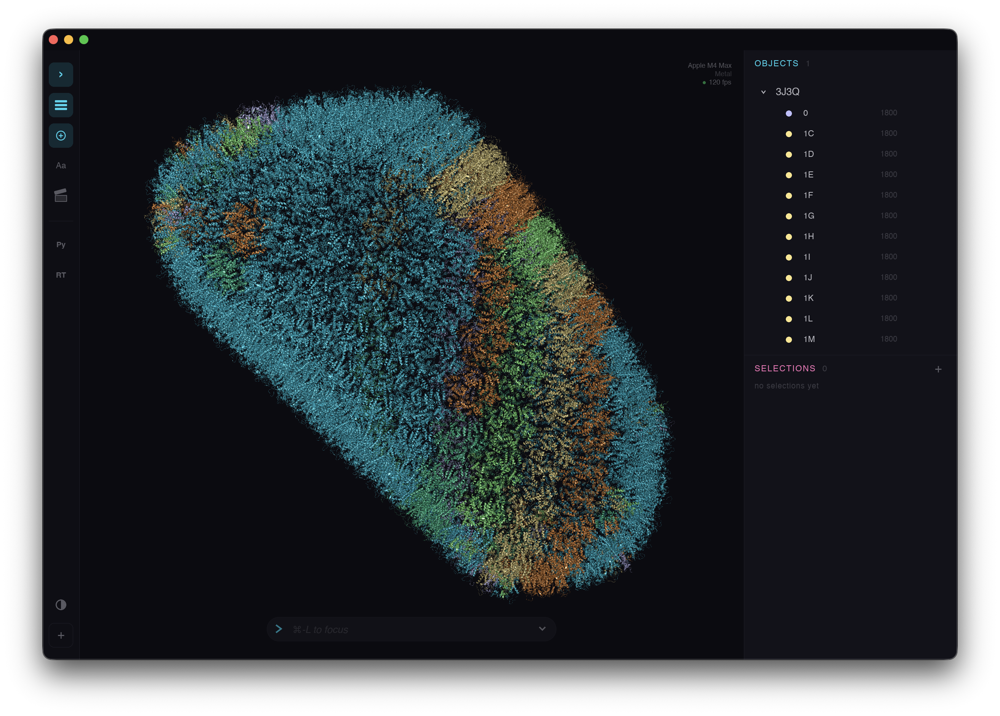
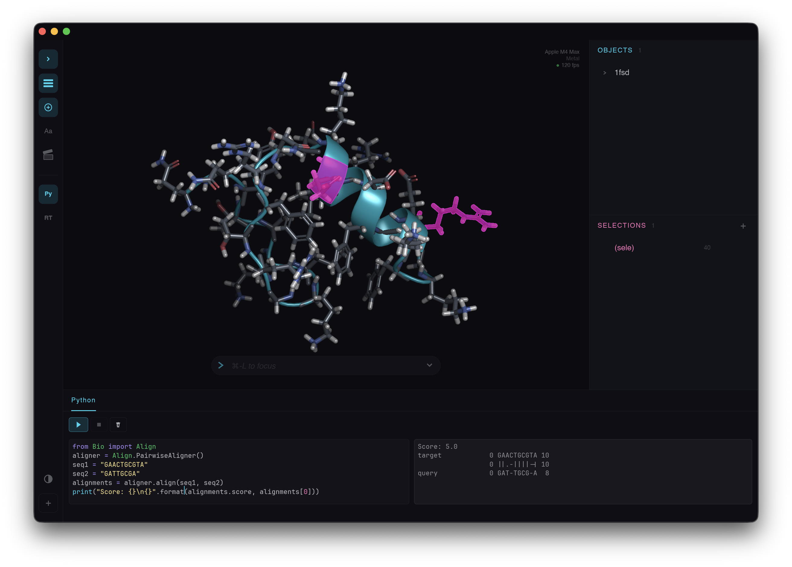

<p align="center">
  
</p>

<h1 align="center">PyMOL-RS</h1>

<p align="center">
  <strong>PyMOL, reimagined in Rust.</strong><br>
  Same power. Modern core. Zero legacy baggage.
</p>

<p align="center">
  
  
  
</p>

---

## Why?

PyMOL is the gold standard for molecular visualization — but it's 25 years of C/C++/Python accumulated into a monolith. PyMOL-RS started as a Rust port of the original PyMOL, carrying over many of its core algorithms and concepts, but has since evolved with its own architectural decisions. It aims to keep the familiar command language and workflow while replacing the engine:

| | PyMOL (classic) | PyMOL-RS |
|---|---|---|
| **Language** | C / C++ / Python | Rust + wgpu |
| **Rendering** | OpenGL 2.x fixed pipeline | WebGPU (wgpu), GPU impostors |
| **Architecture** | Monolithic | Independent crates |
| **Python** | Embedded CPython | PyO3 bindings (optional) |
| **Memory safety** | Manual | Guaranteed at compile time |
| **Cross-platform** | Build scripts per OS | Single `cargo build` |

## Quick Start

### Pre-built binaries

Grab the latest release for your platform from [Releases](https://github.com/zmactep/pymol-rs/releases/latest).

**Standalone executable** — no Python needed:
```bash
pymol-rs protein.pdb
```

**Python wheel** — includes both the CLI and `pymol_rs` module:
```bash
pip install pymol_rs-<version>-<platform>.whl
```

### Build from source

Prerequisites: [Rust](https://rustup.rs/) (cargo), [uv](https://docs.astral.sh/uv/) (Python wheel), [Node.js](https://nodejs.org/) (web version & Jupyter widget). Only cargo is required for the core build — uv and Node.js are needed only for the components listed below.

```bash
git clone https://github.com/zmactep/pymol-rs
cd pymol-rs
make release && make run
```

| Target | Command | Requires |
|--------|---------|----------|
| Release build | `make release` | cargo |
| Debug build | `make debug` | cargo |
| Plugins | `make plugins` | cargo |
| Python wheel | `make python` | cargo, uv |
| Web widget | `make web-build` | cargo, npm |
| Tests | `make test` | cargo |

## Features

**Formats:** PDB · mmCIF · bCIF · MOL2 · SDF/MOL · XYZ · GRO · CCP4/MRC (+ gzip)

**Representations:** Spheres (GPU impostors) · Sticks · Lines · Cartoon · Ribbon · Surface (SAS/SES/VdW) · Mesh · Dots · Labels · Isomesh · Isosurface · Isodot

**Selection language** — full PyMOL-compatible syntax:
```
chain A and name CA
byres around 5 ligand
polymer and not solvent
```

**Commands** — familiar PyMOL verbs with tab completion: `load`, `show`, `hide`, `color`, `select`, `zoom`, `center`, `orient`, `png`, `ray`, …

**Structural analysis:**
- Alignment — Kabsch superposition & CE structural alignment
- Measurements — distance, angle, dihedral with visual feedback
- Crystallographic symmetry — `symexp` with all 230 space groups
- Secondary structure — `dss` assignment from geometry
- Electron density maps — CCP4/MRC loading with `isomesh`, `isosurface`, `isodot` contouring

**Sessions** — save and load your sessions with high-efficiency `.prs` file format or use your old PyMOL sessions with `.pse` parser.

**Ray tracing** — offline GPU ray tracing with BVH acceleration, shadows, and transparency (via the `raytracer` plugin).

**Jupyter widget** — interactive 3D viewer for Jupyter notebooks via [anywidget](https://anywidget.dev/), with full command execution and Python API integration.

**GUI** — egui-based interface with command line, object panel, sequence viewer, mouse picking, and viewport:

<p align="center">
  
</p>

## Python API

```python
from pymol_rs import cmd

cmd.load("protein.pdb")
cmd.show("cartoon")
cmd.color("green", "chain A")
cmd.select("site", "byres around 5 ligand")
cmd.png("output.png", width=1920, height=1080)

# Extend with custom commands
def highlight(selection):
    cmd.color("yellow", selection)

cmd.extend("highlight", highlight)
```

## Web Version

PyMOL-RS runs in the browser via WebAssembly + WebGPU. The viewer is published as an npm package `@pymol-rs/viewer` and can be embedded in any web page.

**JavaScript API:**
```html
<script type="module">
  import { PyMolRSViewer } from "@pymol-rs/viewer";

  const viewer = new PyMolRSViewer(document.getElementById("viewer"));
  await viewer.init();

  await viewer.loadUrl("https://models.rcsb.org/1IGT.bcif.gz", {
    name: "1IGT",
    format: "bcif",
  });

  viewer.execute("show cartoon");
  viewer.execute("color green, chain A");
</script>
```

**Web Component** — register `<pymol-rs-viewer>` as a custom element:
```html
<script type="module">
  import { registerElement } from "@pymol-rs/viewer";
  registerElement();
</script>

<pymol-rs-viewer
  src="https://models.rcsb.org/1IGT.bcif.gz"
  panels="repl,objects,sequence"
  command="show cartoon; color green, chain A">
</pymol-rs-viewer>
```

**Build from source:**
```bash
cd web
npm install
npm run build     # production build → dist/
npm run dev       # dev server with hot reload
```

## Architecture

```
pymol-rs/
├── pymol-mol         Core data: Atom, Bond, Molecule
├── pymol-io          Format parsers & writers
├── pymol-select      Selection language (parser + evaluator)
├── pymol-color       Colors, schemes, ramps
├── pymol-settings    Configuration system
├── pymol-algos       Molecular algorithms
├── pymol-render      wgpu rendering engine
├── pymol-scene       Viewer, camera, scene graph
├── pymol-session     Sessions save and load (`.prs` and `.pse`)
├── pymol-cmd         Command parser & executor
├── pymol-framework   Messaging system and core reusable components
├── pymol-gui         GUI (egui)
└── pymol-plugin      Plugin system
```

Each crate is independently usable. Want just the selection parser? `pymol-select`. Need to read PDB files in your pipeline? `pymol-io` + `pymol-mol`. No GUI tax.

## Plugin System

PyMOL-RS supports a dynamic plugin architecture that lets you extend the application with native Rust shared libraries. Plugins are loaded at startup from `~/.pymol-rs/plugins/` and can register new commands, hook into the command pipeline, and interact with the viewer through the `PluginRegistrar` API.

Plugins are compiled as dynamic libraries (`.dylib` on macOS, `.so` on Linux, `.dll` on Windows). At startup, PyMOL-RS scans the plugin directory, loads each library, and calls its registration entry point. The plugin receives a `PluginRegistrar` that provides capabilities for:

- Registering new commands accessible from the PyMOL-RS command line
- Routing command execution through the `pymol-cmd` dispatcher
- Interacting with the viewer state through the plugin backend

### Reference Plugins

Three reference plugins are included in the `plugins/` directory:

| Plugin | Crate | Description |
|--------|-------|-------------|
| **raytracer** | `raytracer-plugin` | GPU ray tracing — BVH-accelerated compute shader pipeline with shadows, transparency, and edge detection |
| **hello** | `hello-plugin` | Minimal example — registers a single command to demonstrate the plugin lifecycle |
| **ipc** | `ipc-plugin` | Inter-process communication plugin for external tool integration |
| **python** | `python-plugin` | Embedded CPython interpreter via PyO3 — enables Python scripting inside the native binary |

### Python Plugin

<p align="center">
  
</p>


The `python-plugin` embeds a CPython interpreter directly into PyMOL-RS using [PyO3](https://pyo3.rs). This is separate from the standalone Python wheel (`pymol_rs`) — the plugin runs Python _inside_ the native application, allowing scripts to register commands and manipulate the scene without a separate process.

The plugin consists of four modules:

- **engine** — manages the embedded CPython interpreter lifecycle
- **commands** — bridges Python-defined commands into the PyMOL-RS command system
- **backend** — provides Python code with access to the viewer and scene state
- **handler** — dispatches command execution between Rust and Python origins

Python commands registered via `cmd.extend()` from within the embedded interpreter are routed through the same command dispatcher as native commands, with full tab completion and help support.

### Building Plugins

```bash
make plugins
```

This builds all reference plugins and installs them to `~/.pymol-rs/plugins/`. The Python plugin requires a Python installation discoverable by PyO3:

```bash
PYO3_PYTHON=$(python3 -c "import sys; print(sys.executable)") \
    cargo build --release -p raytracer-plugin -p hello-plugin -p ipc-plugin -p python-plugin
```

## Relationship with PyMOL

PyMOL-RS started as a direct Rust port of PyMOL, actively using algorithms from [pymol-open-source](https://github.com/schrodinger/pymol-open-source). Since then, the project has diverged substantially:

- **All molecular algorithms** (CE structural alignment, Kabsch superposition, sequence alignment, space group expansion, surface generation) have been **rewritten from original scientific papers** rather than transliterated from the PyMOL C code.
- **Rendering** has been redesigned around GPU impostors and WebGPU compute pipelines — a fundamentally different approach from PyMOL's OpenGL-based rendering.
- **What remains from PyMOL:** the DSS (secondary structure assignment) algorithm and the settings table used exclusively for `.pse` session import. PyMOL-RS uses its own settings system internally; the PyMOL settings table exists only to parse legacy session files.

The project has deep respect for PyMOL's legacy and shares its Open Source spirit, but it follows an entirely different development path. Keeping the codebase free of direct PyMOL code borrowings is an explicit goal — new functionality is derived from primary sources (academic papers, specifications) rather than ported from the original C/C++ implementation.

## License

[BSD 3-Clause](LICENSE)

## Acknowledgments

Inspired by [PyMOL](https://pymol.org/), created by Warren Lyford DeLano. This is an independent reimplementation, not affiliated with Schrödinger, Inc.
